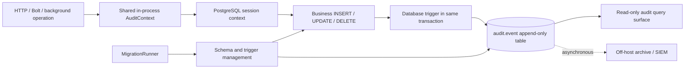

# Centralized Audit Trail Implementation Plan

**Status:** Transactional core implemented; operational hardening remains

**Date:** 2026-09-07

**Scope:** XFramework server-side application data, security activity, and controlled system changes

## Executive decision

Build one centralized audit capability in the shared XFramework persistence infrastructure and load it into every database-writing service. Do **not** put a synchronous standalone audit ingestion service in the business-write path.

The authoritative data-change record should be written by PostgreSQL triggers in the **same database transaction** as the business change. A shared in-process XFramework component should establish the trusted actor, tenant, service, request, and trace context on the database connection. If audit capture fails, the business mutation must fail too.

An optional read API, exporter, or archive process may run separately later. Its failure must only delay search or export; it must never stop local audit capture or cause audit data to be lost.

## Implementation status

As of 2026-09-07, the transactional core and shared attribution path are implemented:

- the central migration creates the append-only audit store, safe-default redaction, generic row trigger, table policy, trigger installer, and coverage verifier;
- every service using `AppDbContext` loads the same shared connection interceptor, which supplies trusted actor, tenant, service, correlation, request, and trace metadata without calling another process;
- `MigrationRunner` establishes a system identity, applies trigger coverage after every migration, and fails deployment if an eligible table is uncovered;
- PostgreSQL integration tests verify ordered changes, soft deletes, redaction and binary omission, transaction rollback, fail-closed behavior, immutability, and trigger coverage.

Operational hardening remains phased work: replace the current shared `dbAdmin` superuser connection with distinct migration/audit/service roles, define retention and PII policy, add the tenant-safe investigation API, and configure off-host immutable export. Those controls require environment credentials and policy-owner decisions; the deployed transactional capture does not depend on them.

This is a hybrid design:

- **Centralized implementation:** one shared XFramework auditing implementation, schema, migration, policy model, and registration extension.
- **Embedded runtime:** every service establishes audit context locally; there is no network call to an audit service before a write.
- **Database-enforced capture:** PostgreSQL records row changes even when EF change tracking is bypassed.
- **Independent durability:** a later asynchronous off-host archive protects against database-owner compromise without becoming a write-path dependency.

## Why this design

### Options considered

| Option | Strength | Critical weakness | Decision |
|---|---|---|---|
| EF Core `SaveChangesInterceptor` only | Easy fit with the current code | Misses `ExecuteUpdate`, `ExecuteDelete`, raw SQL, scripts, and direct database writes | Reject as authoritative capture |
| Synchronous standalone audit service | Central store and logic | Network/service outage can create unaudited writes or stop the platform | Reject for ingestion |
| Application logs/Seq/OpenTelemetry | Good correlation and diagnostics | Sampled/retained differently, mutable, and not a complete row history | Keep as supporting observability only |
| PostgreSQL trigger only | Captures every committed row mutation | Does not inherently know the authenticated user or business operation | Use with shared runtime context |
| Shared runtime context + transactional database trigger + async archive | Complete capture, no ingestion-service dependency, strong attribution and resilience | Requires database permissions, policy management, and careful rollout | **Recommended** |

The proposed arrangement addresses the shutdown concern directly. Killing a business service stops that service from making changes. Killing a separate reader/exporter does not stop audit capture. An attacker using an application database role still cannot disable triggers or update/delete audit records. A database-owner compromise is handled by off-host append-only export and backups, not by pretending the application database is an absolute security boundary.

## Existing infrastructure assessment

### Useful foundations already present

1. `XFramework.Domain` already owns the shared `XDbContext`, `AppDbContext`, and EF interceptor infrastructure.
2. `AuditInterceptor` is registered in the database installers for Bolt, Community, Gateway, IdentityServer, Inventario, Messaging, SmsGateway, and Wallets.
3. `BaseModel` includes `CreatedAt`, `ModifiedAt`, `DeletedAt`, and `TenantId`.
4. `XDbContext` already performs tenant query filtering, tenant validation, and soft-delete conversion.
5. The server modules use PostgreSQL, and the current Docker topology uses one shared PostgreSQL database.
6. `XFramework.MigrationRunner` is the centralized migration entry point.
7. Correlation ID middleware and OpenTelemetry service names are present across the principal APIs.
8. `AuthorizationLog` already records a narrow set of authentication events and demonstrates a read-only audit-style entity.
9. `RequestMetadata` already carries session, tenant, device, IP, and request identifiers on parts of the inter-service protocol.

### Gaps that prevent a proper audit trail today

1. The current `AuditInterceptor` sets timestamps only. It does not record actor, operation, key, old values, new values, or changed fields.
2. `AuditHistory` and `AuditField` are dormant contracts. They have no active configuration, storage registration, writer, or migration and should not be treated as working infrastructure.
3. `BaseModel` has no `CreatedBy`, `ModifiedBy`, or `DeletedBy`. Some Inventario entities define similar fields independently, but the shared interceptor does not populate them.
4. Serilog and OpenTelemetry are diagnostic systems, not immutable audit stores. Production trace sampling also makes tracing unsuitable as an authoritative record.
5. An EF-only solution would not cover future bulk APIs recommended by the project standards, raw SQL, migration scripts, or direct database administration.
6. The remote `SaveChangesRequest` contains only serialized changes. It carries no audit context. `MessageQueueHub.ExecuteChanges` also has no authorization requirement in the inspected implementation. Trustworthy remote-write attribution is impossible until this path is authenticated and contextual metadata is propagated or derived server-side.
7. One JWT construction path sets the credential ID in `ClaimTypes.Name` but does not include the tenant claim expected by `XDbContext`. Actor and tenant claim conventions must be normalized.
8. The current deployment configuration does not separate application database identities from database/migration ownership. An application role with owner-level rights can disable any in-database protection.
9. `Fluid.ApplicationDbContext` does not inherit from `XDbContext` and is outside the shared interceptor path.
10. Browser IndexedDB changes are client-controlled and cannot be authoritative audit records. Only changes accepted and committed by the server can be trusted.

## Target architecture



### Capture guarantees

- A committed business mutation and its audit event are atomic.
- A rolled-back business mutation leaves no data-change audit event because no data change was committed.
- If the trigger cannot write the audit event, the business mutation fails (**fail closed**).
- Missing actor context does not silently suppress capture. It is recorded as `Unknown` during rollout and raises an alert. Sensitive tables can later require a known actor or explicitly named system actor.
- The trigger captures tracked EF writes, bulk writes, raw SQL, and direct writes performed by non-owner database roles.
- Diagnostic logs and traces enrich investigation but are not part of the completeness guarantee.

## Centralized component placement

Keep the implementation in the existing `XFramework.Domain` project because it already owns persistence, Npgsql, `XDbContext`, and interceptors. A new microservice or a separate package is unnecessary for the first implementation.

Proposed structure:

```text
src/Kernel/XFramework.Domain/
  Auditing/
    AuditContext.cs
    AuditActorKind.cs
    IAuditContextAccessor.cs
    HttpAuditContextAccessor.cs
    AuditContextConnectionInterceptor.cs
    AuditOptions.cs
    AuditServiceCollectionExtensions.cs
    AuditHealthCheck.cs
  Interceptors/
    AuditTimestampInterceptor.cs
  Migrations/
    <timestamp>_AddCentralAuditTrail.cs
```

The existing timestamp interceptor should be renamed to `AuditTimestampInterceptor` so it is not confused with the authoritative audit-trail capture. Existing entity timestamps remain useful business metadata but are not the history ledger.

Expose one registration method, for example `AddXFrameworkPersistence(...)`, that registers:

- `IHttpContextAccessor`;
- the timestamp interceptor;
- the audit-context connection interceptor;
- `AppDbContext` and its standard Npgsql options;
- the server data context;
- audit health checks and metrics.

Each module's `DbInstaller` should call this one extension rather than reimplementing the registrations. The application/service identity should come from `IHostEnvironment.ApplicationName`, not from eight copied string constants.

## Audit context model

Create one scoped `AuditContext` for each inbound operation. It should contain:

| Field | Source | Notes |
|---|---|---|
| `ChangeSetId` | Generated at operation start | Groups all rows changed by one logical operation |
| `ActorKind` | Auth/system context | `User`, `Service`, `BackgroundJob`, `Anonymous`, or `Unknown` |
| `ActorId` | Validated identity claim | Stable credential/user identifier; do not use display name as identity |
| `ActorTenantId` | Validated tenant claim/context | Tenant of the actor, distinct from the row's tenant |
| `ImpersonatorId` | Validated claim when applicable | Required for support/admin impersonation |
| `SessionId` | Validated session or request metadata | Nullable for service/background operations |
| `ServiceName` | Host application name | Also retain the database `session_user` as the trusted service principal |
| `Environment` | Host environment | Development, staging, production, etc. |
| `InstanceId` | Runtime/pod identity | Useful during incident response |
| `OperationName` | Endpoint/activity name | Optional semantic name such as `Wallet.Transfer` |
| `Reason` | Explicit administrative input | Required for selected high-risk operations |
| `CorrelationId` | Existing middleware | Normalize and length-limit client-supplied values |
| `TraceId` / `SpanId` | `Activity.Current` | Investigation link only; never rely on sampled trace retention |
| `RequestId` | Existing request metadata | Preserve across Bolt calls |
| `ClientIp` / `UserAgent` | Server-observed request | Classify as sensitive and retention-controlled |

Rules:

1. User and tenant IDs must come from validated server-side identity, never directly from request bodies or headers.
2. Background work must start an explicit system audit scope naming the job and service; it must not impersonate the last HTTP user.
3. Service-to-service calls must propagate a signed/authenticated identity and correlation context. The receiving service derives the audit actor; it does not trust arbitrary serialized metadata.
4. Store both `ActorTenantId` and `SubjectTenantId`. A mismatch is important evidence for platform-admin or cross-tenant operations.
5. Never place passwords, tokens, secrets, OTPs, or full request bodies in the audit context.

## Passing context to PostgreSQL

The shared connection interceptor should set namespaced PostgreSQL session settings on every opened application connection, using parameterized `set_config` calls. The default Npgsql pool reset behavior must be verified with an integration test so context cannot leak between pooled connections.

Example settings:

```text
xframework.audit.change_set_id
xframework.audit.actor_kind
xframework.audit.actor_id
xframework.audit.actor_tenant_id
xframework.audit.impersonator_id
xframework.audit.session_id
xframework.audit.service_name
xframework.audit.environment
xframework.audit.instance_id
xframework.audit.operation_name
xframework.audit.reason
xframework.audit.correlation_id
xframework.audit.trace_id
xframework.audit.span_id
xframework.audit.request_id
xframework.audit.client_ip
xframework.audit.user_agent
```

The database trigger reads these settings with `current_setting(..., true)`. `session_user`, database name, schema, table, transaction ID, and server timestamp must be derived by PostgreSQL and cannot be overridden by application context.

Before implementation, run a focused prototype covering:

- automatically opened EF connections;
- explicitly opened connections;
- explicit Wallet batch transactions;
- pooled connection reuse;
- `ExecuteUpdate` / `ExecuteDelete`;
- raw SQL commands;
- Bolt-created scopes;
- retry execution strategies.

If session-scoped settings cannot be proven leak-free for every supported path, switch to transaction-local settings and require the shared persistence layer to establish them at transaction start. Do not ship a best-effort context mechanism.

## Database audit schema

Create an `audit` schema owned by a dedicated `audit_owner` role. Use one unified append-only `audit.event` table for data changes and explicit security/system events.

### Proposed core columns

| Column | Purpose |
|---|---|
| `event_id` | Monotonic database-generated retrieval sequence |
| `event_uuid` | Globally unique stable identifier |
| `event_kind` | `DataChange`, `SecurityActivity`, `SystemChange`, or `AuditAccess` |
| `recorded_at` | PostgreSQL `timestamptz`, generated by the database |
| `transaction_id` | PostgreSQL transaction identifier for grouping atomic changes |
| `transaction_ordinal` | Deterministic order of events inside one transaction |
| `change_set_id` | Logical application-operation grouping ID |
| `operation` | `Insert`, `Update`, `Delete`, `SoftDelete`, or semantic event action |
| `database_user` | PostgreSQL `session_user`; identifies the connecting service role |
| `service_name`, `environment`, `instance_id` | Runtime origin |
| `actor_kind`, `actor_id`, `actor_tenant_id`, `impersonator_id` | Who initiated the operation |
| `subject_tenant_id_before`, `subject_tenant_id_after` | Tenant ownership of the affected row before and after |
| `session_id`, `request_id`, `correlation_id`, `trace_id`, `span_id` | Cross-system investigation keys |
| `operation_name`, `reason` | Business/admin intent when available |
| `schema_name`, `table_name` | Physical data source |
| `entity_key` | Primary key values as JSONB, including composite keys |
| `changed_fields` | Sorted list of changed columns |
| `old_values`, `new_values` | Redacted JSONB values; update events store changed values only |
| `metadata` | Strictly bounded JSONB for event-kind-specific non-secret context |

For inserts, store the allowed new-row values. For deletes, store the allowed old-row values. For updates, store only fields whose values are distinct, with their old and new values. Record a soft delete as `SoftDelete` when the update changes `IsDeleted` from false to true.

Do not inherit the audit entity from `BaseModel`: audit records are never soft-deleted, tenant filtering has different rules, and they cannot be updated through normal entity services.

### Ordering semantics

Use `event_id` for deterministic retrieval, `transaction_id` to group an atomic commit, and `transaction_ordinal` to order changes within that transaction. Never claim that wall-clock timestamps alone establish exact order between concurrent transactions.

A sequence allocated in a trigger represents capture order, not guaranteed PostgreSQL commit order under concurrency. If exact cross-transaction commit ordering becomes a requirement, the asynchronous archive should add PostgreSQL WAL commit LSN from logical decoding. The API must document this distinction.

### Indexes and growth

Start with indexes for the actual investigation paths:

- `(subject_tenant_id_after, event_id DESC)`;
- `(schema_name, table_name, event_id DESC)`;
- GIN on `entity_key` or a derived stable entity-key hash;
- `(actor_id, event_id DESC)`;
- `(correlation_id)` and `(change_set_id)`;
- BRIN on `recorded_at` for large chronological scans.

Audit-table volume should be measured during the pilot. Introduce time partitioning before production if projected retention or deletion-by-retention requires it; do not add partition orchestration without a measured need and an ownership plan.

## Trigger and policy management

Create one generic trigger function and attach it to every eligible application table. Exclude:

- the `audit` schema itself, to prevent recursion;
- `__EFMigrationsHistory` from row-change history because migrations receive their own system events;
- explicitly approved ephemeral/technical tables;
- database views and tables without a stable identity only when an approved alternative exists.

The MigrationRunner should call an owner-only `audit.ensure_table_triggers()` function after migrations and then run a coverage check. Production startup should fail deployment—not every service startup—if an eligible table lacks its trigger.

Create an owner-managed `audit.table_policy` / `audit.column_policy` registry containing:

- whether the table is audited;
- primary-key strategy;
- excluded columns;
- redacted columns;
- hash-only columns if needed;
- optional required-reason flag;
- retention/event classification.

Safe defaults are essential:

1. New application tables are audited by default.
2. Audit values for passwords, password hashes, tokens, refresh tokens, API keys, secrets, OTPs, private keys, and binary payloads are always redacted or omitted.
3. A redacted field still appears in `changed_fields`, so investigators know it changed without seeing its value.
4. Opting a table or column out requires a reviewed migration, not a runtime configuration toggle.
5. Policy changes are themselves recorded as `SystemChange` events through owner-only procedures.

## Security and tamper resistance

### Required PostgreSQL roles

- `migration_owner`: may apply reviewed migrations and manage application schema objects.
- `audit_owner`: owns the audit schema, table, trigger function, and policies.
- one distinct login role per service: may mutate only required business tables and execute approved audit context/event functions.
- `audit_reader`: read-only access through approved views/functions.
- `platform_auditor`: explicitly approved cross-tenant read access.

Application roles must not be able to:

- update, delete, or truncate `audit.event`;
- directly insert fabricated data-change events;
- alter/drop audit triggers or trigger functions;
- change audit policies;
- assume owner or migration roles;
- disable triggers through replication/superuser privileges.

Use a `SECURITY DEFINER` trigger function owned by `audit_owner`, with a fixed safe `search_path`, and revoke public execution. Verify all grants in automated tests.

### Threat boundaries

- **Compromised application process:** database trigger still records its mutations; distinct `session_user` identifies the compromised service. The process may lie about propagated user context, so retain both trusted database identity and claimed/validated actor context.
- **Service killed or isolated:** it cannot mutate its database, so it cannot produce unaudited business changes.
- **Reader/exporter killed:** local transactional audit capture continues. Export lag alerts fire.
- **Application database role stolen:** least privilege prevents removal or disabling of audit evidence.
- **Database owner/superuser compromised:** local evidence can be rewritten. Protect against this with WAL/backups and asynchronous off-host append-only export.

### Off-host archive

After the transactional foundation is stable, export audit events asynchronously to a separately credentialed append-only store or immutable object storage with retention lock. Prefer PostgreSQL logical decoding/CDC when operationally available because it supplies commit LSN and does not require each service to publish audit messages.

The exporter may be centralized because it is not the capture authority. It must support checkpointed, idempotent replay and expose lag. If unavailable, PostgreSQL remains the source of truth until export resumes. Establish disk/WAL-lag limits and alerts so an extended outage cannot silently exhaust storage.

For stronger tamper evidence, periodically sign a batch manifest containing event range, row count, digest, and archive location, then store that manifest outside the application database. Do this after append-only roles and off-host retention are working; a local hash chain alone does not protect against a database owner that can rewrite both rows and chain state.

## System and security events

Database triggers answer **what committed data changed**. Use a shared owner-controlled function/writer for important events that do not map to a successful row mutation:

- login success/failure, authorization denial, lockout, and session revocation;
- administrative export or bulk read of audit data;
- impersonation start/stop;
- manual maintenance action and reason;
- migration applied, application version, and source commit/deployment ID;
- audit policy change;
- background job start/result when it has compliance significance.

Migrate or project the existing `AuthorizationLog` into this unified security-event view after the data-change capture is stable. Do not remove the existing authorization history until parity and retention have been verified.

Code, deployment, infrastructure, and secret-store changes originate outside the application database. Preserve their authoritative Git/CI/CD/platform audit records and correlate them through deployment ID, commit SHA, service version, and environment. Never copy secret values into `audit.event`.

## Tenant-aware access and query surface

Capture and querying have different trust requirements. Do not expose `audit.event` through generic generated CRUD endpoints.

Provide cursor-paginated, read-only query operations supporting:

- tenant and time range;
- entity type/table and primary key;
- actor or impersonator;
- operation/event kind;
- service/environment;
- correlation, request, trace, transaction, or change-set ID;
- changed field.

Enforce tenant visibility at the database role/RLS or security-definer query-function boundary in addition to application authorization:

- tenant auditors see events where their tenant is the subject, subject to privacy policy;
- platform auditors require a distinct role and explicit authorization;
- actor-tenant/subject-tenant mismatches remain visible to platform security;
- audit exports require reason, are rate-limited, and create `AuditAccess` events;
- no update/delete endpoints exist;
- audit query responses are not cached unless a reviewed immutable-page strategy is introduced.

A separate read-only Audit API is acceptable later because it is not involved in capture. If it is attacked or unavailable, only search is affected; writes and audit capture continue.

## Coverage boundaries

| Write surface | Planned treatment |
|---|---|
| Services using shared `AppDbContext` | Automatic database trigger plus shared context |
| `ServerDataContext` and source-generated CRUD | Covered at PostgreSQL regardless of calling abstraction |
| Wallet explicit transactions | Covered; prototype context behavior and transaction grouping |
| EF bulk operations and raw SQL | Covered by database triggers |
| Bolt remote changes | Database changes covered; trustworthy actor attribution requires authenticated propagation/derivation |
| Direct database scripts using an application role | Covered and attributed to `session_user`; actor may be `Unknown` |
| Migration/DDL | Separate `SystemChange` record plus migration history and CI/CD evidence |
| `Fluid.ApplicationDbContext` | Explicitly onboard to shared registration/triggers or document exclusion before rollout |
| Browser IndexedDB/local-first state | Not authoritative; audit when the server validates and commits synchronized changes |
| External systems | Store correlation/reference IDs; retain the external system's authoritative audit log |

## Phased implementation plan

### Phase 0 — Decision record and inventory

1. Convert the executive decision in this document into an approved ADR.
2. Inventory every database, schema, table, write-capable service, background worker, direct SQL/script path, and database role in each environment.
3. Classify sensitive columns and tables with legal/security owners.
4. Decide retention and tenant-access requirements by event class.
5. Define the ordering guarantee and investigator vocabulary (`Actor`, `SubjectTenant`, `ChangeSet`, `Transaction`).

**Exit criteria:** all production write surfaces and sensitive fields have an owner and an audit policy; no unknown database-writing process remains.

### Phase 1 — Transactional database foundation

1. Add the `audit` schema, enum/check constraints, append-only `audit.event` table, indexes, and policy tables in a central EF migration.
2. Implement the owner-safe generic trigger function for insert/update/delete/soft-delete diffs.
3. Implement owner-only trigger installation and coverage-verification functions.
4. Add role/grant migrations separating audit ownership, migration ownership, readers, and service roles.
5. Update MigrationRunner to ensure triggers and report coverage after applying migrations.
6. Keep the old timestamp interceptor and authorization log operational during this phase.

**Exit criteria:** all pilot-table mutations create atomic redacted events; app roles cannot alter audit data or trigger configuration; trigger failure rolls back the business write.

### Phase 2 — Shared in-process attribution

1. Add `AuditContext`, `IAuditContextAccessor`, and the Npgsql connection/transaction integration to `XFramework.Domain`.
2. Normalize user, tenant, session, impersonation, correlation, trace, and service identity rules.
3. Add explicit system scopes for background jobs and migrations.
4. Consolidate repeated `DbInstaller` registrations into one shared persistence extension.
5. Add health checks and metrics for context availability and trigger presence.
6. Validate connection-pool reset and transaction semantics under load.

**Exit criteria:** a committed audit event reliably identifies database service principal, application service, actor, actor tenant, subject tenant, request/change set, and trace context without cross-request leakage.

### Phase 3 — Remote and non-HTTP paths

1. Require authentication/authorization for Bolt query and change execution.
2. Extend the protocol only with signed or server-verifiable audit propagation; do not trust arbitrary client metadata.
3. Ensure `RequestId`, session, tenant, and originating service survive service hops.
4. Cover scheduled/background work, startup jobs, and maintenance commands with explicit system actors.
5. Onboard or explicitly exclude `Fluid.ApplicationDbContext`.

**Exit criteria:** no server-side write path produces an unattributed event except an intentionally tested `Unknown` fallback that raises an alert.

### Phase 4 — Policy, privacy, and operational hardening

1. Apply reviewed redaction/exclusion policies to every table.
2. Add required-reason enforcement for sensitive administrative operations.
3. Add storage growth, capture failure, unknown actor, trigger coverage, and policy drift metrics/alerts.
4. Load-test representative Inventario, Identity, Messaging, and Wallet batch writes.
5. Decide and implement partitioning only if volume/retention measurements justify it.
6. Document incident response, legal hold, retention purge, and recovery procedures.

**Exit criteria:** no sensitive value appears in sampled audit output; performance is within the agreed budget; operations can detect capture or coverage degradation before data loss.

### Phase 5 — Read-only investigation surface

1. Add authorized, cursor-paginated query functions/views and API endpoints.
2. Add entity history, actor activity, transaction/change-set, and correlation timelines.
3. Add controlled export with reason, authorization, rate limits, and audit-of-audit access.
4. Add a ControlPanel view only after backend authorization and tenant isolation tests pass.

**Exit criteria:** an auditor can answer who changed what, when, from which service/request, and see redacted before/after values without gaining mutation access.

### Phase 6 — Independent archive and tamper evidence

1. Export committed events through CDC or an idempotent checkpointed exporter.
2. Store them under a separate security boundary with append-only/retention-lock controls.
3. Add signed batch manifests and periodic reconciliation of source counts/ranges to archive counts/ranges.
4. Test prolonged exporter outage, replay, duplicate delivery, and disaster recovery.

**Exit criteria:** loss or compromise of the query/export component does not affect capture, and compromise of the application database can be detected against off-host evidence.

### Phase 7 — Rollout

1. Start in report-only mode for context gaps while still capturing every change.
2. Pilot with Inventario and IdentityServer, then Wallets batch transactions.
3. Compare expected writes with audit counts and manually reconstruct representative histories.
4. Roll out service by service using one central migration and shared runtime version.
5. Change protected tables from `Unknown + alert` to fail-closed known actor/system actor where operationally safe.
6. Deprecate `AuditHistory`/`AuditField` only after the new system is live; preserve or migrate historical `AuthorizationLog` data according to retention policy.

**Exit criteria:** every production database-writing service passes coverage, attribution, redaction, permissions, rollback, and recovery checks.

## Verification strategy

Use PostgreSQL integration tests, not EF in-memory tests, for the capture guarantee.

Required scenarios:

1. Insert, update, hard delete, and XFramework soft delete capture correct operation and diffs.
2. No-op updates do not create misleading changed fields.
3. Multiple row changes share a change set and transaction ID and have deterministic transaction ordinals.
4. Rollback removes both business and audit rows.
5. Trigger failure prevents the business write.
6. `ExecuteUpdate`, `ExecuteDelete`, and raw SQL are captured.
7. Composite keys and database-generated keys are recorded correctly.
8. Actor tenant and row tenant are independently preserved, including tenant reassignment.
9. Pooled connections never leak actor/context from a previous request.
10. Background jobs receive explicit system actors without an HTTP context.
11. Bolt writes preserve authenticated origin and correlation.
12. Sensitive values are redacted while their field names remain visible as changed.
13. Application roles cannot update/delete/truncate audit rows, disable triggers, or change policies.
14. Tenant auditors cannot read another tenant's events; platform-auditor access is explicit.
15. A newly added table fails migration/deployment coverage checks if its audit policy/trigger is missing.
16. Exporter outage and replay do not lose or duplicate logical archive events.
17. Audit queries remain cursor-paginated and performant at projected retention volume.

Recommended performance gate for the pilot: agree on a write-latency and throughput budget before implementation, measure it on representative single-row and Wallet batch workloads, and make the result an explicit production rollout criterion rather than assuming trigger overhead is negligible.

## Operational metrics and alerts

At minimum expose:

- audit events written by kind/service/table;
- capture failures;
- missing/unknown actor context;
- actor-tenant/subject-tenant mismatch;
- eligible tables without enabled triggers;
- audit schema and policy drift;
- audit table/index size and growth rate;
- oldest/newest retained event;
- archive checkpoint and lag;
- archive reconciliation mismatch;
- failed audit query authorization and bulk export activity.

Alert immediately on capture failure, trigger/policy drift, unauthorized audit-table DML, or archive reconciliation mismatch. Alert by capacity threshold on storage and exporter lag.

## Decisions still requiring owners

These choices should be resolved in Phase 0 rather than guessed in code:

1. Retention period per data/security/system event class and any tenant-specific legal requirements.
2. Which roles may perform cross-tenant investigations and exports.
3. Which fields qualify as PII and whether masked, hash-only, or omitted handling is required.
4. Whether sensitive administrative changes require a ticket/reference and free-text reason.
5. The acceptable write overhead for normal and Wallet batch workloads.
6. The off-host archive technology and recovery objectives.
7. Whether exact cross-transaction commit ordering is required, which would make WAL LSN capture part of the archive requirement.

## Definition of done

The audit system is complete only when all of the following are true:

- every committed production row mutation on an in-scope table creates an atomic audit event;
- investigators can identify what changed, old/new values, actor, actor tenant, subject tenant, service, time, transaction, and request/change set;
- sensitive values are not stored in audit data;
- application services cannot disable capture or mutate/delete evidence;
- a capture failure prevents the corresponding business mutation;
- every supported write path, including bulk/raw/remote/background paths, is tested;
- audit querying is tenant-safe, read-only, paginated, and itself audited for sensitive access;
- off-host evidence and recovery procedures protect against database-owner compromise;
- coverage, context gaps, storage growth, and archive lag are monitored and alerted;
- the architecture and operational guarantees are documented without overstating concurrent commit ordering.
