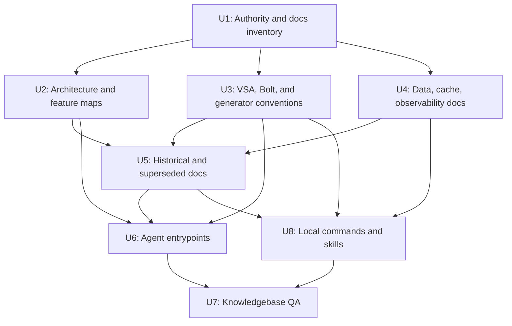

# refactor: Refresh AI Agent Knowledgebase

## Summary

Refresh XFramework's documentation knowledgebase so future AI agents can quickly understand the current architecture, feature surfaces, conventions, and historical traps. The work updates existing canonical docs in place, adds missing navigation and architecture maps, labels stale guidance safely, and then refreshes lightweight AI entrypoints to point agents at the right sources.

---

## Problem Frame

The current repository has a strong codebase and a substantial `docs/solutions/` knowledgebase, but AI-agent guidance is split across `AGENTS.md`, `CLAUDE.md`, root historical markdown files, `.github/copilot-instructions.md`, `src/Features/README.md`, and many solution docs. Research found active guidance that still mentions stale StreamFlow/SignalR, MediatR/CQRS, Serilog, .NET 9, and C# 13 assumptions even though the current code and newer docs center .NET 10/C# 14, VSA, generated Minimal APIs, Bolt, `IBoltRequest`, `MapGeneratedEndpoints()`, EF Core 10, custom caching, ZLogger, and OpenTelemetry.

The plan deliberately treats this as documentation architecture work, not code implementation. The outcome should make `docs/solutions/` the durable knowledgebase, make entrypoints discoverable for multiple agent tools, and prevent future agents from following historical or superseded guidance as if it were current.

---

## Requirements

- R1. Map current XFramework architecture and feature surfaces from the repository, including projects, modules, VSA endpoints, source generators, Bolt, data access, caching, observability, UI, tests, build/deployment, and existing docs.
- R2. Update the existing knowledgebase rather than creating a competing parallel documentation system.
- R3. Make future-agent onboarding discoverable from `AGENTS.md`, `CLAUDE.md`, `.github/copilot-instructions.md`, `README.md`, and `docs/README.md`.
- R4. Normalize active guidance around current implementation reality: .NET 10/C# 14, VSA, Minimal APIs, `[BoltHandler]`, `IBoltRequest`, `MapGeneratedEndpoints()`, `AppDbContext`, custom caching, ZLogger, and OpenTelemetry.
- R5. Preserve useful historical records while clearly labeling superseded root docs, migration notes, and plan files so agents do not treat them as current instructions.
- R6. Preserve `docs/solutions/` conventions, including YAML frontmatter and existing canonical paths used by local skills and commands.
- R7. Provide a concrete verification path for link integrity, stale terminology classification, frontmatter consistency, and agent discoverability.

---

## Scope Boundaries

- No runtime code behavior changes are in scope.
- No source generator, API, EF Core, cache, logging, or UI implementation changes are in scope.
- Historical `docs/plans/*` files should not be rewritten for current terminology; they should be explained as historical execution artifacts through `docs/plans/README.md`.
- Historical architecture docs that intentionally discuss SignalR, StreamFlow, MediatR, Serilog, or previous .NET versions should retain that context when clearly labeled as historical, comparative, or deprecated.
- Third-party or vendored README files, such as `src/Modules/XFramework.Coins/Client/Coins.Web/Coins.Web/wwwroot/css/open-iconic/README.md`, are out of scope.
- Local machine configuration files, secrets-adjacent files, build artifacts, `bin/`, `obj/`, `.idea/`, and generated artifacts are out of scope.

### Deferred to Follow-Up Work

- Automated documentation linting: a separate change can add markdown-link or frontmatter validation to CI after the knowledgebase shape stabilizes.
- Full per-module reference manuals: this plan creates a feature surface map and representative module inventory, not exhaustive implementation manuals for every endpoint.
- Workflow/config modernization: stale names in deployment files such as `.workflows/streamflow.service.yaml` may need a separate implementation plan because they are runtime/config surfaces, not documentation-only knowledgebase work.
- Deep rewrite of `.opencode/skills/*`: this plan keeps skills compatible and updates links if needed, but broad skill redesign should stay separate.

---

## Context & Research

### Relevant Code and Patterns

- `XFramework.slnx` organizes the repo into Shared, Kernel, Infrastructure, SourceGenerators, Services, Presentation, Libraries/Bolt, Tests, and Tools.
- `global.json`, `Directory.Packages.props`, `Directory.Build.props`, and `Version.props` establish .NET 10/C# 14 and package/version assumptions.
- `src/Modules/XFramework.IdentityServer/IdentityServer.Api/Features/Auth/Authenticate/Endpoint.cs`, `src/Modules/XFramework.Wallets/Wallets.Api/Features/Wallets/Transfer/Endpoint.cs`, `src/Modules/XFramework.Communications/Communications.Api/Features/Messages/CreateMessage/Endpoint.cs`, `src/Modules/XFramework.Community/Community.Api/Features/Content/Create/Endpoint.cs`, and `src/Modules/XFramework.Inventario/Inventario.Api/Features/Products/Create/Endpoint.cs` are representative VSA endpoint examples.
- `src/SourceGenerators/XFramework.SourceGenerators/BoltHandlerGenerator.cs`, `src/SourceGenerators/XFramework.SourceGenerators/EntityEndpointGenerator.cs`, `src/SourceGenerators/XFramework.SourceGenerators/EntityServiceGenerator.cs`, `src/SourceGenerators/XFramework.SourceGenerators/ServiceWrapperGenerator.cs`, and `src/SourceGenerators/XFramework.SourceGenerators/DataContextRegistrationGenerator.cs` are the source-generation surfaces that docs must describe accurately.
- `src/Infrastructure/XFramework.Integration/Attributes/MapEndpointAttributes.cs`, `src/Shared/XFramework.Domain.Shared/Attributes/GenerateEndpointsAttribute.cs`, and `src/Kernel/XFramework.Core/Extensions/EndpointDiscoveryExtensions.cs` anchor generated endpoint discovery.
- `src/Libraries/Bolt/Bolt.Protocol/Protocol/BoltCodec.cs`, `src/Libraries/Bolt/Bolt.Client/BoltClient.cs`, `src/Libraries/Bolt/Bolt.Server/BoltServer.cs`, `src/Modules/XFramework.Bolt/Bolt.Hub/Services/BoltHubService.cs`, `src/Libraries/Bolt/Bolt.Media/BoltMediaClient.cs`, and `src/Libraries/Bolt/Bolt.Media.Browser/BoltMediaService.cs` anchor Bolt protocol, server, client, hub, media, and browser guidance.
- `src/Kernel/XFramework.Domain/Contexts/AppDbContext.cs`, `src/Kernel/XFramework.Domain/Contexts/XDbContext.cs`, `src/Tools/XFramework.MigrationRunner/Program.cs`, `src/Kernel/XFramework.Core/DataContext/ServerDataContext.cs`, and `src/Infrastructure/XFramework.Integration/DataContext/RemoteDataContext.cs` anchor EF Core and remote data-context guidance.
- `src/Kernel/XFramework.Core/Services/Caching/HybridCacheService.cs`, `src/Infrastructure/XFramework.Integration/DataContext/Cache/ClientCacheService.cs`, and `src/Infrastructure/XFramework.Integration/DataContext/Cache/CacheKeyBuilder.cs` anchor caching guidance.
- `src/Infrastructure/XFramework.Integration/Extensions/LoggingExtensions.cs`, `src/Infrastructure/XFramework.Integration/Logging/ZLoggerSeqSink.cs`, `src/Kernel/XFramework.Core/Extensions/OpenTelemetryExtensions.cs`, `src/Kernel/XFramework.Core/Observability/ActivitySources.cs`, and `src/Kernel/XFramework.Core/Middlewares/CorrelationIdMiddleware.cs` anchor logging and observability guidance.
- `src/Modules/XFramework.Blazor/Core/Features/BaseActionHandler.cs`, `src/Modules/XFramework.Blazor/Core/Services/IndexedDbService.cs`, `src/Presentation/ControlPanel.Server/Program.cs`, `src/Presentation/ControlPanel.Server/Components/Pages/Finance/Wallets.razor`, and `src/Presentation/ControlPanel.Server/Components/Pages/Identity/Users.razor` anchor Blazor/UI feature surface mapping.
- `src/Tests/Bolt.Tests/TransportTests.cs`, `src/Tests/XFramework.Core.Tests/Services/Caching/HybridCacheServiceTests.cs`, `src/Tests/IdentityServer.IntegrationTests/Tests/AuthenticationTests.cs`, `src/Tests/Wallets.IntegrationTests/Tests/WalletTransactionTests.cs`, and `src/Tests/ControlPanel.E2ETests/ControlPanelE2ETests.cs` anchor testing topology.

### Institutional Learnings

- `docs/README.md` states the repo has consolidated architecture, migration, source-generator, and standards material into `docs/solutions/`.
- `docs/solutions/conventions/xframework-best-practices.md` is the clearest canonical implementation standard and should remain stable.
- `docs/solutions/conventions/xframework-vsa-agent-playbook.md` is agent-oriented but needs current-state language rather than migration-planning language.
- `docs/solutions/architecture-patterns/xframework-architecture-hardening.md` identifies source-generator fragility, module composition drift, cache/config correctness, and test gaps that future agents should understand.
- `docs/solutions/architecture-patterns/bolt-signalr-removal.md` and `docs/solutions/architecture-patterns/bolt-unified-transport-layer.md` establish that Bolt supersedes SignalR/StreamFlow as active transport guidance while preserving historical context.
- `docs/solutions/architecture-patterns/unified-zlogger-logging-pipeline.md` establishes ZLogger as canonical and conflicts with older Serilog references in `docs/solutions/tooling-decisions/opentelemetry-integration-guide.md`.
- `docs/solutions/tooling-decisions/generated-endpoint-auto-discovery.md` and `docs/solutions/tooling-decisions/generate-endpoints-attribute-usage.md` are complementary and should be cross-linked rather than merged blindly.
- `docs/solutions/architecture-patterns/vsa-entity-placement-strategy.md` preserves the rule that `Domain.Shared` stays lightweight while generated wrapper entities belong under API surfaces.

### External References

- External research was intentionally skipped because the task is repository-specific and local patterns are strong enough to define the plan.

---

## Key Technical Decisions

- **Authority hierarchy and conflict resolution:** Entry points route agents but do not govern implementation details; `docs/solutions/conventions/xframework-best-practices.md` governs general implementation conventions; specialized `docs/solutions/` docs govern their subsystem; current source code wins when docs conflict with implemented behavior; historical or superseded docs never override current solution docs.
- **Cross-entrypoint parity invariant:** `AGENTS.md`, `CLAUDE.md`, `.github/copilot-instructions.md`, `.opencode/commands/*`, and `.opencode/skills/xframework-*` should share the same minimal invariant set: current stack, canonical docs, stale-pattern warnings, and task-specific routing.
- **Update in place before creating new docs:** Existing canonical files should be merged/refreshed in place to preserve inbound links from `.opencode/skills/*`, `.opencode/commands/*`, and prior docs.
- **Create maps, not a second manual:** New architecture and feature surface docs should be navigational, evidence-backed, and link-heavy. They should identify representative source paths and topic owners rather than duplicating every rule from existing docs.
- **Classify stale terms by context:** StreamFlow, SignalR, MediatR, Serilog, and older .NET references should be removed from active guidance, retained in historical/migration/comparative context, and explicitly marked when the occurrence means "do not use."
- **Use a fixed stale-term taxonomy:** Stale-term findings should be classified as `current`, `deprecated/do-not-use`, `historical`, `migration narrative`, `comparative`, or `unknown/defer`; ambiguous occurrences should be labeled or deferred instead of silently rewritten.
- **Define content ownership boundaries:** Architecture maps orient readers and answer "where to look"; feature maps inventory modules and representative paths; best practices define canonical rules; VSA playbook guides task execution; subsystem docs own their own details.
- **Canonical docs first, entrypoints last:** Entry files should point at accurate docs. Updating `AGENTS.md`, `CLAUDE.md`, `README.md`, and `.github/copilot-instructions.md` before canonical docs are refreshed would route agents to stale material.
- **Docs verification replaces code tests:** Because this is documentation-only work, completion is proven through link checks, frontmatter checks, stale-term classification, path existence, and fresh-agent discoverability scenarios rather than unit/integration test files.

---

## Open Questions

### Resolved During Planning

- Should the plan update only knowledgebase docs or also agent entrypoints? Resolved by user choice: include docs plus lightweight entrypoint updates.
- Should external best-practice research be used? Resolved: skip external research because this is a current-repo knowledgebase refresh and local evidence is more authoritative.
- Should historical plan files be rewritten for current terminology? Resolved: no; preserve plans as historical records and explain their role in `docs/plans/README.md`.
- Should existing canonical docs be replaced? Resolved: no; update and merge in place unless a document is explicitly superseded.

### Deferred to Implementation

- Exact stale-term disposition for each occurrence: the implementer must classify occurrences during the full markdown scan because context determines whether a term is active guidance, historical context, benchmark comparison, or "do not use" guidance.
- Exact heading structure for refreshed docs: preserve useful existing structure where possible and adjust headings only when needed for clarity and stable links.
- Whether any `.opencode/skills/*` or `.opencode/commands/*` file needs content changes beyond link/reference refresh: decide after canonical doc paths and headings are finalized.

---

## Output Structure

The expected documentation shape is below. This is a scope declaration, not an implementation constraint; if implementation finds a better placement, preserve the same authority hierarchy and repo-relative linking discipline.

```text
docs/
|-- README.md
|-- plans/
|   |-- README.md
|   `-- 2026-05-21-001-refactor-ai-agent-knowledgebase-plan.md
`-- solutions/
    |-- README.md
    |-- architecture-patterns/
    |   `-- xframework-agent-architecture-surface-map.md
    `-- conventions/
        |-- ef-core-data-access-patterns.md
        |-- xframework-best-practices.md
        |-- xframework-feature-surface-map.md
        `-- xframework-vsa-agent-playbook.md
```

---

## High-Level Technical Design

> *This illustrates the intended approach and is directional guidance for review, not implementation specification. The implementing agent should treat it as context, not code to reproduce.*



---

## Implementation Units

### U1. Establish Documentation Authority And Indexes

**Goal:** Define where current guidance lives, how docs are classified, and how agents should navigate the knowledgebase before content updates begin.

**Requirements:** R1, R2, R5, R6, R7

**Dependencies:** None

**Files:**
- Modify: `docs/README.md`
- Create: `docs/solutions/README.md`
- Create: `docs/plans/README.md`
- Inspect: `CLAUDE.md`
- Inspect: `README.md`
- Inspect: `docs/solutions/conventions/xframework-best-practices.md`
- Inspect: `docs/solutions/conventions/xframework-vsa-agent-playbook.md`

**Approach:**
- Make `docs/README.md` the repository documentation map, not a duplicate architecture guide.
- Add `docs/solutions/README.md` as the category map for architecture patterns, best practices, conventions, design patterns, developer experience, tooling decisions, and workflow issues.
- Add `docs/plans/README.md` to explain filename conventions, active vs historical status, and why old plans should not be edited for current terminology.
- Document the authority hierarchy explicitly: entrypoints route agents, `docs/solutions/` holds current knowledge, and `docs/plans/` preserves execution history.
- Preserve and document the existing `docs/solutions/` YAML metadata shape: `title`, `date`, `category`, `module`, `problem_type`, `component`, `severity`, `applies_when`, and `tags`.
- Treat `docs/solutions/README.md` as an evolving index: U1 creates the category taxonomy, U2/U4 add newly created docs, U5 adds historical/superseded pointers, and U7 verifies the final index.

**Execution note:** Start with a documentation inventory before editing so existing active, historical, superseded, and duplicate docs are classified deliberately.

**Patterns to follow:**
- `docs/README.md` for existing Compound Engineering documentation categories.
- `docs/solutions/conventions/xframework-best-practices.md` for solution-doc frontmatter and practical agent-facing style.
- `docs/plans/2026-04-25-001-refactor-unified-zlogger-migration-plan.md` for historical plan naming precedent.

**Test scenarios:**
- Documentation check: starting from `docs/README.md`, follow links to `docs/solutions/README.md` and `docs/plans/README.md`; each destination explains its role without requiring prior context.
- Metadata check: `docs/solutions/README.md` documents the expected frontmatter schema without claiming that later-created docs already exist.
- Historical check: `docs/plans/README.md` explains that old plan files are historical unless frontmatter marks them active.

**Verification:**
- A reader starting at `docs/README.md` can identify the canonical current docs, historical plans, and where new solution docs belong.
- `docs/solutions/README.md` lists every existing `docs/solutions/` category and distinguishes canonical guidance from historical decision records.
- `docs/plans/README.md` states that plan files are historical artifacts unless their frontmatter says otherwise.
- `docs/solutions/README.md` documents the metadata schema that U7 later validates for all new or changed solution docs.

### U2. Create Architecture And Feature Surface Maps

**Goal:** Add current, evidence-backed maps of XFramework architecture and feature surfaces so future agents can orient themselves without rediscovering the whole repo.

**Requirements:** R1, R2, R4, R6, R7

**Dependencies:** U1

**Files:**
- Create: `docs/solutions/architecture-patterns/xframework-agent-architecture-surface-map.md`
- Create: `docs/solutions/conventions/xframework-feature-surface-map.md`
- Modify: `docs/solutions/README.md`
- Modify: `docs/README.md`
- Inspect: `XFramework.slnx`
- Inspect: `src/Shared/XFramework.Domain.Shared/XFramework.Domain.Shared.csproj`
- Inspect: `src/Kernel/XFramework.Core/XFramework.Core.csproj`
- Inspect: `src/Kernel/XFramework.Domain/XFramework.Domain.csproj`
- Inspect: `src/Infrastructure/XFramework.Integration/XFramework.Integration.csproj`
- Inspect: `src/SourceGenerators/XFramework.SourceGenerators/XFramework.SourceGenerators.csproj`
- Inspect: `src/Libraries/Bolt/Bolt.Protocol/Bolt.Protocol.csproj`
- Inspect: `src/Modules/XFramework.IdentityServer/IdentityServer.Api/IdentityServer.Api.csproj`
- Inspect: `src/Modules/XFramework.Wallets/Wallets.Api/Wallets.Api.csproj`
- Inspect: `src/Modules/XFramework.Communications/Communications.Api/Communications.Api.csproj`
- Inspect: `src/Modules/XFramework.Community/Community.Api/Community.Api.csproj`
- Inspect: `src/Modules/XFramework.SmsGateway/SmsGateway.Api/SmsGateway.Api.csproj`
- Inspect: `src/Modules/XFramework.Inventario/Inventario.Api/Inventario.Api.csproj`
- Inspect: `src/Modules/XFramework.Coins/Server/Coins.Api/Coins.Api.csproj`
- Inspect: `src/Modules/XFramework.Payments/Payments.Core/Payments.Core.csproj`
- Inspect: `src/Modules/XFramework.Payments/Payments.Domain.Shared/Payments.Domain.Shared.csproj`
- Inspect: `src/Modules/XFramework.Payments/Payments.Core/README.md`
- Inspect: `src/Modules/XFramework.Blazor/XFramework.Blazor.csproj`
- Inspect: `src/Presentation/ControlPanel.Server/ControlPanel.Server.csproj`
- Inspect: `src/Tests/Bolt.Tests/Bolt.Tests.csproj`
- Inspect: `global.json`
- Inspect: `Directory.Packages.props`
- Inspect: `Directory.Build.props`
- Inspect: `Version.props`
- Inspect: `Dockerfile`
- Inspect: `.github/workflows/publish.yml`
- Inspect: `.workflows/streamflow.service.yaml`
- Inspect: `src/Libraries/Bolt/BOLT.md`
- Inspect: `src/Libraries/Bolt/BOLT-MEDIA.md`
- Inspect: `src/Libraries/Bolt/Bolt.Client/Bolt.Client.csproj`
- Inspect: `src/Libraries/Bolt/Bolt.Server/Bolt.Server.csproj`
- Inspect: `src/Libraries/Bolt/Bolt.Media/Bolt.Media.csproj`
- Inspect: `src/Libraries/Bolt/Bolt.Media.Browser/Bolt.Media.Browser.csproj`
- Inspect: `src/Modules/XFramework.Bolt/Bolt.Hub/Bolt.Hub.csproj`
- Inspect: `src/Modules/XFramework.Bolt/Bolt.Domain.Shared/Bolt.Domain.Shared.csproj`

**Approach:**
- Use `xframework-agent-architecture-surface-map.md` as a navigational map of project roles, layers, transport, source generation, data access, UI, tests, tools, and build/deploy surfaces.
- Use `xframework-feature-surface-map.md` as a module-to-feature index that distinguishes manual VSA endpoints, generated entity CRUD, service classes, Domain.Shared contracts, integration wrappers, presentation surfaces, and test projects.
- Prefer concise tables and path references over long duplicated explanations.
- Mark representative examples rather than attempting to document every endpoint in full.
- Link existing detailed docs instead of restating their full content.
- Treat build, deployment, and workflow files as observed architecture/config surfaces only; do not expand this unit into runtime workflow modernization.

**Patterns to follow:**
- `docs/solutions/architecture-patterns/xframework-architecture-hardening.md` for architecture-risk framing.
- `docs/solutions/conventions/xframework-best-practices.md` for conventions format.
- `README.md` for current high-level Bolt/module framing.

**Test scenarios:**
- Path check: every representative source path named in the architecture and feature maps exists, or is explicitly labeled historical/deferred.
- Coverage check: the feature map includes each major module named in U2 Verification and does not omit Payments, Bolt Hub, Blazor, Presentation, Tests, or Tools.
- Duplication check: map docs link to detailed convention/subsystem docs instead of restating detailed rules already owned elsewhere.

**Verification:**
- The architecture map covers Shared, Kernel, Infrastructure, SourceGenerators, Libraries/Bolt, Modules, Presentation, Tests, Tools, docs, build, deployment, and config surfaces.
- The feature surface map covers IdentityServer, Wallets, Communications, Community, SmsGateway, Inventario, Payments, Coins, Blazor, Bolt Hub, and Presentation apps at an orientation level.
- Every representative path listed in the maps exists or is explicitly marked as historical/deferred.
- The maps link to existing canonical docs instead of creating a second competing standard.

### U3. Refresh VSA, Bolt, And Generated Endpoint Guidance

**Goal:** Align active implementation guidance with current code patterns for VSA endpoints, Bolt handlers, generated routes, validators, services, contracts, and source generator registration.

**Requirements:** R2, R4, R5, R6, R7

**Dependencies:** U1, U2

**Files:**
- Modify: `docs/solutions/conventions/xframework-best-practices.md`
- Modify: `docs/solutions/conventions/xframework-vsa-agent-playbook.md`
- Modify: `src/Features/README.md`
- Modify: `docs/solutions/tooling-decisions/generated-endpoint-auto-discovery.md`
- Modify: `docs/solutions/tooling-decisions/generate-endpoints-attribute-usage.md`
- Modify: `docs/solutions/developer-experience/migration-to-auto-discovery.md`
- Modify: `src/Libraries/Bolt/BOLT.md`
- Modify: `src/Libraries/Bolt/BOLT-MEDIA.md`
- Inspect: `src/Infrastructure/XFramework.Integration/Attributes/MapEndpointAttributes.cs`
- Inspect: `src/Shared/XFramework.Domain.Shared/Attributes/GenerateEndpointsAttribute.cs`
- Inspect: `src/Kernel/XFramework.Core/Extensions/EndpointDiscoveryExtensions.cs`
- Inspect: `src/SourceGenerators/XFramework.SourceGenerators/BoltHandlerGenerator.cs`
- Inspect: `src/SourceGenerators/XFramework.SourceGenerators/EntityEndpointGenerator.cs`
- Inspect: `src/SourceGenerators/XFramework.SourceGenerators/EntityServiceGenerator.cs`
- Inspect: `src/SourceGenerators/XFramework.SourceGenerators/ServiceWrapperGenerator.cs`
- Inspect: `src/SourceGenerators/XFramework.SourceGenerators/DataContextRegistrationGenerator.cs`
- Inspect: `src/SourceGenerators/XFramework.SourceGenerators/ChangeTrackerGenerator.cs`
- Inspect: `src/SourceGenerators/XFramework.SourceGenerators/BaseSourceGenerator.cs`
- Inspect: `src/Modules/XFramework.IdentityServer/IdentityServer.Api/Program.cs`
- Inspect: `src/Modules/XFramework.Wallets/Wallets.Api/Program.cs`
- Inspect: `src/Modules/XFramework.Communications/Communications.Api/Program.cs`

**Approach:**
- Replace active StreamFlow/SignalR implementation guidance with Bolt terminology where code supports it.
- Document `[BoltHandler]`, `IBoltRequest`, generated Minimal API attributes, validators, `app.MapGeneratedEndpoints()`, and generated service/wrapper discovery as current patterns.
- Preserve "do not use MediatR/CQRS for new work" warnings where useful, but avoid presenting MediatR/CQRS as current architecture.
- Update `src/Features/README.md` to either point to module-level `src/Modules/XFramework.{Module}/{Module}.Api/Features/` conventions or clearly mark any old generic guidance as superseded.
- Cross-link generated endpoint auto-discovery and attribute usage docs so agents understand declaration vs registration boundaries.
- Own declaration and registration mechanics in this unit: endpoint attributes, `[GenerateEndpoints]`, source generator outputs, `MapGeneratedEndpoints()`, manual vs generated endpoints, and Bolt handler generation.
- Cross-link cache-related generated endpoint options to U4-owned caching docs instead of explaining cache semantics here.

**Patterns to follow:**
- Current module endpoints under `src/Modules/XFramework.IdentityServer/IdentityServer.Api/Features/`, `src/Modules/XFramework.Wallets/Wallets.Api/Features/`, `src/Modules/XFramework.Communications/Communications.Api/Features/`, and `src/Modules/XFramework.Community/Community.Api/Features/`.
- `docs/solutions/tooling-decisions/generated-endpoint-auto-discovery.md` for discovery and registration concepts.
- `docs/solutions/tooling-decisions/generate-endpoints-attribute-usage.md` for entity-level generation options.

**Test scenarios:**
- Stale-term check: search changed VSA/generator/Bolt docs for `StreamFlow`, `SignalR`, `MediatR`, and `CQRS`; every remaining occurrence is historical, comparative, migration-related, or explicit "do not use" guidance.
- Pattern check: docs that describe generated endpoints point to current representative module `Program.cs` and source-generator files.
- Boundary check: generated endpoint docs link to caching docs for cache behavior instead of duplicating cache-key and invalidation rules.

**Verification:**
- Active guidance tells agents to use current Bolt/generator conventions and no longer instructs them to create StreamFlow/SignalR handlers.
- Remaining StreamFlow, SignalR, MediatR, or CQRS mentions in these files are explicitly historical, migration-related, comparative, or "do not use" guidance.
- Existing inbound references from `.opencode/skills/*` and `.opencode/commands/*` still land on current guidance.
- The docs distinguish manual VSA endpoints from entity-generated CRUD endpoints.

### U4. Refresh Data, Caching, Observability, And Remote Context Docs

**Goal:** Bring supporting technical subsystem docs in line with current implementation so architecture maps and agent entrypoints do not point to stale or conflicting guidance.

**Requirements:** R1, R2, R4, R5, R6, R7

**Dependencies:** U1, U2

**Files:**
- Create: `docs/solutions/conventions/ef-core-data-access-patterns.md`
- Modify: `docs/solutions/best-practices/xframework-caching-strategy.md`
- Modify: `docs/solutions/tooling-decisions/opentelemetry-integration-guide.md`
- Modify: `docs/solutions/conventions/logging-standards.md`
- Modify: `docs/solutions/architecture-patterns/unified-zlogger-logging-pipeline.md`
- Modify: `docs/solutions/architecture-patterns/decentralized-remote-data-context.md`
- Modify: `docs/solutions/architecture-patterns/local-first-sync-architecture.md`
- Modify: `rules/UiGuidelines.md`
- Inspect: `src/Kernel/XFramework.Domain/Contexts/AppDbContext.cs`
- Inspect: `src/Kernel/XFramework.Domain/Contexts/XDbContext.cs`
- Inspect: `src/Kernel/XFramework.Domain/Interceptors/AuditInterceptor.cs`
- Inspect: `src/Tools/XFramework.MigrationRunner/Program.cs`
- Inspect: `src/Kernel/XFramework.Core/DataContext/ServerDataContext.cs`
- Inspect: `src/Infrastructure/XFramework.Integration/DataContext/RemoteDataContext.cs`
- Inspect: `src/Kernel/XFramework.Core/Services/Caching/HybridCacheService.cs`
- Inspect: `src/Infrastructure/XFramework.Integration/DataContext/Cache/ClientCacheService.cs`
- Inspect: `src/Infrastructure/XFramework.Integration/Extensions/LoggingExtensions.cs`
- Inspect: `src/Kernel/XFramework.Core/Extensions/OpenTelemetryExtensions.cs`

**Approach:**
- Add an EF Core/data access convention guide covering entity/config placement, `AppDbContext` assembly discovery, module `Domain.Shared` configurations, migrations, Testcontainers, remote data-context, and performance rules.
- Update caching guidance to distinguish custom `HybridCacheService`, Redis/distributed cache, remote data-context client cache, module-local cache services, and generated endpoint cache options.
- Reconcile observability guidance so ZLogger, Seq, OpenTelemetry resources, correlation IDs, health checks, and metrics agree across docs.
- Remove or qualify Serilog references from active observability guidance while preserving historical "removed/replaced" context where useful.
- Keep subsystem docs linked from the architecture map and `docs/solutions/README.md`.
- Own data/cache semantics in this unit: EF Core, migrations, remote data-context, cache keys, invalidation, `HybridCacheService`, client cache, ZLogger, Seq, correlation, metrics, health, and OpenTelemetry.
- Classify `local-first-sync-architecture.md` carefully because draft/proposed StreamFlow-era language can look like active guidance unless labeled.

**Patterns to follow:**
- `docs/solutions/architecture-patterns/decentralized-remote-data-context.md` for remote data-context architecture.
- `docs/solutions/architecture-patterns/unified-zlogger-logging-pipeline.md` for current logging decisions.
- `docs/solutions/best-practices/xframework-caching-strategy.md` for cache-key and invalidation conventions.

**Test scenarios:**
- Observability conflict check: active guidance in logging and OTel docs agrees that ZLogger is current and Serilog is historical/removed if mentioned.
- Cache ownership check: caching docs own key/invalidation/runtime cache semantics, while generated endpoint docs only link to them for cache behavior.
- Data-context check: EF and remote data-context docs distinguish local EF operations, migration runner responsibilities, and remote `IDataContext` flows.
- Draft-status check: `local-first-sync-architecture.md` is clearly marked current, draft/proposed, historical, or superseded.

**Verification:**
- EF Core docs explain current `AppDbContext` discovery, module configuration placement, migration runner role, and test surface.
- Caching docs explicitly state the repo currently uses a custom cache service and do not imply a different .NET built-in cache is already adopted.
- Observability docs no longer conflict about Serilog vs ZLogger in active guidance.
- Remote data-context docs give future agents enough context to understand server/client data flow without treating it as generic EF usage.

### U5. Classify Historical And Superseded Legacy Docs

**Goal:** Prevent stale high-visibility markdown files from misleading future agents while preserving historical context and useful records.

**Requirements:** R2, R5, R6, R7

**Dependencies:** U1, U2, U3, U4

**Files:**
- Modify: `XFramework-Knowledge-Base.md`
- Modify: `XFramework-Development-Roadmap.md`
- Modify: `XFramework-Improvement-Plan.md`
- Modify: `PHASE3-VSA-MIGRATION-JOURNAL.md`
- Modify: `XFramework-Analysis-Journal-2025-01-24-1140.md`
- Modify: `XFramework-Phase1-Completion-2025-01-24.md`
- Modify: `src/Modules/XFramework.Payments/Payments.Core/README.md`
- Modify: `docs/README.md`
- Modify: `docs/solutions/README.md`
- Inspect: `docs/plans/2026-03-31-001-refactor-bolt-unified-transport-plan.md`
- Inspect: `docs/plans/2026-04-07-001-refactor-bolt-signalr-removal-plan.md`

**Approach:**
- Audit each root-level legacy markdown file identified during U1, excluding active entrypoints handled by U6, and classify it as current, historical, superseded pointer, or roadmap/journal.
- Prefer short supersession notices and links to current canonical docs over full rewrites when a file is mostly stale.
- Treat `XFramework-Knowledge-Base.md` as the highest-risk stale file because research found .NET 9, C# 13, Clean Architecture, MediatR, SignalR, Serilog, and old docs-folder assumptions.
- Preserve journals, roadmap artifacts, and migration narratives as historical records when they explain why the architecture changed.
- Ensure the docs index tells agents not to use historical root docs as implementation authority.

**Patterns to follow:**
- `docs/plans/README.md` from U1 for historical artifact language.
- `docs/solutions/architecture-patterns/bolt-signalr-removal.md` for preserving historical migration context without making it active guidance.

**Test scenarios:**
- Status-label check: every legacy markdown file identified during inventory has an explicit current, historical, superseded, roadmap, or journal status.
- Negative navigation check: starting from `XFramework-Knowledge-Base.md` cannot lead an agent to treat .NET 9, C# 13, Clean Architecture, MediatR, SignalR, or Serilog as current guidance.
- Preservation check: migration/history docs that intentionally discuss old technologies retain their context instead of being globally rewritten.

**Verification:**
- Every legacy root markdown file identified during inventory is either current guidance or clearly labeled as historical/superseded with links to current docs.
- `XFramework-Knowledge-Base.md` no longer functions as an unqualified current source of truth if its stale content remains.
- Historical references to old technologies are preserved only when their historical/comparative status is obvious.
- No root doc contradicts the authority hierarchy without an explicit status note.

### U6. Refresh Root And External Agent Entrypoints

**Goal:** Make future-agent and human onboarding lead to the refreshed knowledgebase without duplicating full guidance in every entrypoint.

**Requirements:** R3, R4, R5, R6, R7

**Dependencies:** U1, U2, U3, U4, U5

**Files:**
- Modify: `AGENTS.md`
- Modify: `CLAUDE.md`
- Modify: `.github/copilot-instructions.md`
- Modify: `README.md`

**Approach:**
- Keep `AGENTS.md` lightweight but no longer dependent on a Claude-specific include convention alone; include direct links to `CLAUDE.md`, `docs/README.md`, `docs/solutions/README.md`, and project-local skills.
- Refresh `CLAUDE.md` as the concise AI-agent quickstart: current stack, authority hierarchy, before-coding checklist, where to find canonical docs, and high-risk stale technology warnings.
- Update `.github/copilot-instructions.md` so Copilot users are routed to XFramework-specific VSA/Bolt/source-generator docs instead of generic .NET layered-architecture advice.
- Add a small documentation/agent guidance section to `README.md` without turning the public README into an agent manual.
- Define expected routes from each root/external entrypoint, such as `AGENTS.md` to `CLAUDE.md` to best practices, `README.md` to `docs/README.md`, and `.github/copilot-instructions.md` to VSA/Bolt/source-generator guidance.

**Patterns to follow:**
- `CLAUDE.md` existing role as agent entrypoint, but with stale transport guidance removed or qualified.
- `docs/README.md` and `docs/solutions/README.md` from U1 as the durable map.

**Test scenarios:**
- Fresh-agent route check: from `AGENTS.md` to `CLAUDE.md` to `docs/solutions/conventions/xframework-best-practices.md` within two clicks.
- Documentation route check: from `README.md` to `docs/README.md` to `docs/solutions/README.md` within two clicks.
- Copilot route check: from `.github/copilot-instructions.md` to VSA, Bolt, and source-generator guidance without endorsing generic layered architecture.

**Verification:**
- Starting from `AGENTS.md`, a future agent can reach current architecture, best-practices, source-generation, Bolt, data-access, caching, observability, and test guidance within two clicks.
- `CLAUDE.md` no longer presents StreamFlow/SignalR or MediatR/CQRS as current implementation architecture.
- `.github/copilot-instructions.md` points Copilot toward the same canonical docs and does not encourage conflicting generic layered architecture.
- Root and external entrypoints route readers to project-local skills without treating those skills as the primary documentation authority.

### U8. Reconcile Project-Local Commands And Skills

**Goal:** Keep project-local OpenCode commands and skills compatible with the refreshed canonical docs without turning them into duplicated documentation manuals.

**Requirements:** R2, R3, R4, R5, R6, R7

**Dependencies:** U1, U2, U3, U4, U5

**Files:**
- Inspect: `.opencode/commands/new-feature.md`
- Inspect: `.opencode/commands/new-service.md`
- Inspect: `.opencode/commands/new-test.md`
- Inspect: `.opencode/commands/new-validator.md`
- Inspect: `.opencode/commands/audit-module.md`
- Inspect: `.opencode/commands/review-code.md`
- Inspect: `.opencode/commands/fix-caching.md`
- Inspect: `.opencode/commands/fix-ef.md`
- Inspect: `.opencode/commands/modernize.md`
- Inspect: `.opencode/skills/xframework-new-feature/SKILL.md`
- Inspect: `.opencode/skills/xframework-new-service/SKILL.md`
- Inspect: `.opencode/skills/xframework-new-test/SKILL.md`
- Inspect: `.opencode/skills/xframework-new-validator/SKILL.md`
- Inspect: `.opencode/skills/xframework-audit-module/SKILL.md`
- Inspect: `.opencode/skills/xframework-review-code/SKILL.md`
- Inspect: `.opencode/skills/xframework-fix-caching/SKILL.md`
- Inspect: `.opencode/skills/xframework-fix-ef/SKILL.md`
- Inspect: `.opencode/skills/xframework-modernize/SKILL.md`

**Approach:**
- Treat commands and skills as active agent-instruction surfaces, not passive docs.
- Modify only files with stale links, stale stack guidance, missing canonical references, or references to superseded docs.
- Preserve the existing pattern where commands/skills point to canonical docs and task rules instead of copying large architecture sections.
- Ensure the modernize command/skill reflects .NET 10/C# 14 and links to current conventions.

**Patterns to follow:**
- `.opencode/skills/xframework-new-feature/SKILL.md` and `.opencode/commands/new-feature.md` for task-specific references.
- `.opencode/skills/xframework-modernize/SKILL.md` for modernization-specific stack guidance.

**Test scenarios:**
- Skill route check: starting from `.opencode/skills/xframework-new-feature/SKILL.md`, an agent lands on current VSA/new-feature guidance rather than superseded root docs.
- Modernization check: `.opencode/commands/modernize.md` and `.opencode/skills/xframework-modernize/SKILL.md` do not conflict with .NET 10/C# 14 guidance.
- Minimal-churn check: files with already-current links remain unchanged unless they need stale-term or path correction.

**Verification:**
- No project-local command or skill points to a superseded doc as current authority.
- Commands and skills continue to reference canonical docs instead of duplicating long guidance.
- Any command/skill changes are limited to links, stale terminology, stack version references, or concise routing updates.

### U7. Run Knowledgebase QA And Reconciliation

**Goal:** Verify the refreshed knowledgebase is coherent, linkable, and safe for future agents before the documentation change is considered complete.

**Requirements:** R1, R3, R4, R5, R6, R7

**Dependencies:** U1, U2, U3, U4, U5, U6, U8

**Files:**
- Inspect: `AGENTS.md`
- Inspect: `CLAUDE.md`
- Inspect: `.github/copilot-instructions.md`
- Inspect: `README.md`
- Inspect: `docs/README.md`
- Inspect: `docs/solutions/README.md`
- Inspect: `docs/plans/README.md`
- Inspect: `docs/solutions/architecture-patterns/xframework-agent-architecture-surface-map.md`
- Inspect: `docs/solutions/conventions/xframework-feature-surface-map.md`
- Inspect: `docs/solutions/conventions/xframework-best-practices.md`
- Inspect: `docs/solutions/conventions/xframework-vsa-agent-playbook.md`
- Inspect: `docs/solutions/conventions/ef-core-data-access-patterns.md`
- Inspect: `src/Features/README.md`
- Inspect: `docs/solutions/tooling-decisions/generated-endpoint-auto-discovery.md`
- Inspect: `docs/solutions/tooling-decisions/generate-endpoints-attribute-usage.md`
- Inspect: `docs/solutions/developer-experience/migration-to-auto-discovery.md`
- Inspect: `docs/solutions/best-practices/xframework-caching-strategy.md`
- Inspect: `docs/solutions/tooling-decisions/opentelemetry-integration-guide.md`
- Inspect: `docs/solutions/conventions/logging-standards.md`
- Inspect: `docs/solutions/architecture-patterns/unified-zlogger-logging-pipeline.md`
- Inspect: `docs/solutions/architecture-patterns/decentralized-remote-data-context.md`
- Inspect: `docs/solutions/architecture-patterns/local-first-sync-architecture.md`
- Inspect: `src/Libraries/Bolt/BOLT.md`
- Inspect: `src/Libraries/Bolt/BOLT-MEDIA.md`
- Inspect: `XFramework-Knowledge-Base.md`
- Inspect: `XFramework-Development-Roadmap.md`
- Inspect: `XFramework-Improvement-Plan.md`
- Inspect: `PHASE3-VSA-MIGRATION-JOURNAL.md`
- Inspect: `XFramework-Analysis-Journal-2025-01-24-1140.md`
- Inspect: `XFramework-Phase1-Completion-2025-01-24.md`
- Inspect: `src/Modules/XFramework.Payments/Payments.Core/README.md`
- Inspect: `.opencode/skills/xframework-new-feature/SKILL.md`
- Inspect: `.opencode/skills/xframework-modernize/SKILL.md`
- Inspect: `.opencode/commands/new-feature.md`
- Inspect: `.opencode/commands/modernize.md`

**Approach:**
- Perform a path/link audit across changed markdown files.
- Search changed docs for stale technology terms and classify every remaining occurrence as `current`, `deprecated/do-not-use`, `historical`, `migration narrative`, `comparative`, or `unknown/defer`.
- Check `docs/solutions/**/*.md` frontmatter for compatibility with the existing metadata schema.
- Walk the fresh-agent scenario from `AGENTS.md`, `CLAUDE.md`, `.github/copilot-instructions.md`, `README.md`, and `docs/README.md`.
- Confirm no new doc duplicates an existing canonical doc's responsibility.
- Produce implementation-summary artifacts: a changed-file link audit table, a stale-term disposition table, a frontmatter compatibility checklist, a fresh-agent route table, and a duplicate-responsibility checklist.
- The fresh-agent route table must list each starting surface, exact link path, target doc, expected canonical authority, and stale-pattern warning encountered.

**Patterns to follow:**
- `docs/solutions/` metadata conventions from U1.
- Flow analyzer acceptance criteria: fresh-agent quickstart, new-feature lookup, pattern research, historical-doc safety, link integrity, and skill compatibility.

**Test scenarios:**
- Link audit check: for every markdown file created or modified by U1-U6 and U8, each repo-relative link resolves or is explicitly marked as future/deferred.
- Stale-term disposition check: every occurrence of `StreamFlow`, `SignalR`, `MediatR`, `CQRS`, `Serilog`, `.NET 9`, and `C# 13` in changed active docs has a recorded classification.
- Frontmatter check: every new or changed `docs/solutions/**/*.md` file has compatible YAML metadata.
- Negative navigation check: starting from stale root markdown files cannot produce an unqualified current instruction to use superseded technologies.
- Route matrix check: expected starts include `AGENTS.md`, `CLAUDE.md`, `.github/copilot-instructions.md`, `README.md`, `docs/README.md`, `.opencode/skills/xframework-new-feature/SKILL.md`, and `.opencode/commands/modernize.md`.

**Verification:**
- Every repo-relative link introduced or edited points to an existing path or heading, or is explicitly marked as future/deferred.
- Stale terms `StreamFlow`, `SignalR`, `MediatR`, `CQRS`, `Serilog`, `.NET 9`, and `C# 13` remain only when clearly historical, comparative, superseded, or cautionary.
- New `docs/solutions/` files include compatible YAML frontmatter.
- A future agent following only entrypoint docs or project-local skill docs lands on current XFramework architecture and implementation conventions.
- No changed doc says `docs/brainstorms/` exists as an always-present folder unless it clarifies the folder is created on demand.

---

## System-Wide Impact

- **Interaction graph:** The change affects documentation discovery across root entrypoints, `docs/solutions/`, `docs/plans/`, `.github/copilot-instructions.md`, and project-local `.opencode` commands/skills.
- **Error propagation:** The main failure mode is misinformation propagation: stale docs or stale prompt surfaces cause future agents to generate code against removed or superseded patterns.
- **State lifecycle risks:** Historical documents must remain historically accurate while active documents become current. Overwriting history or leaving stale files unlabeled are both risks.
- **API surface parity:** No runtime APIs change, but documentation must maintain parity across Claude/OpenCode/Copilot entrypoints and project-local skill prompts so different agents receive consistent guidance.
- **Active prompt surfaces:** `.opencode/commands/*` and `.opencode/skills/xframework-*` are high-impact because they can bypass root entrypoints and inject stale instructions directly into implementation workflows.
- **Integration coverage:** Unit tests do not prove this work. Cross-entrypoint navigation and stale-term classification are the integration checks.
- **Unchanged invariants:** Existing source code, package versions, generated endpoint behavior, Bolt transport behavior, EF migrations, deployment config, and tests remain unchanged.

---

## Alternative Approaches Considered

- **Create a separate `kb/` directory:** Rejected because the repository already consolidated knowledge under `docs/solutions/`; a new hierarchy would create another discovery surface and increase drift risk.
- **Rewrite all documentation from scratch:** Rejected because existing solution docs contain valuable institutional context, frontmatter, and inbound references from skills/commands.
- **Only update `CLAUDE.md`:** Rejected because non-Claude agents, GitHub Copilot, docs browsers, and local skills need discoverable and consistent guidance beyond a single root file.
- **Mass replace stale terms globally:** Rejected because some SignalR, StreamFlow, MediatR, Serilog, and old .NET references are valid in migration history, benchmark comparison, or "do not use" warnings.

---

## Success Metrics

- A future agent can start at `AGENTS.md` and identify the current architecture, canonical conventions, and task-specific docs without relying on Claude-only include behavior.
- A future agent can also start from `.github/copilot-instructions.md`, `.opencode/skills/xframework-new-feature/SKILL.md`, or `.opencode/commands/modernize.md` without receiving conflicting current guidance.
- Active guidance contains no unqualified instructions to use StreamFlow, SignalR, MediatR/CQRS, Serilog, .NET 9, or C# 13 for new XFramework work.
- `docs/solutions/README.md` and `docs/README.md` make the knowledgebase navigable by category and authority.
- The architecture and feature surface maps cover all major project areas at orientation level with repo-relative source references.
- Existing `.opencode/skills/*` and `.opencode/commands/*` continue to point at current canonical docs.
- New `docs/solutions/` docs follow the existing metadata conventions.

---

## Dependencies / Prerequisites

- Access to the current repository checkout and its markdown/source files.
- No external documentation service or package installation is required.
- Implementation should avoid editing local/private config files such as `.compound-engineering/config.local.yaml`.

---

## Risk Analysis & Mitigation

| Risk | Likelihood | Impact | Mitigation |
|------|------------|--------|------------|
| Duplicate canonical docs create more drift | High | High | Update existing canonical docs in place and make new docs navigational maps. |
| Stale transport terminology remains in active guidance | High | High | Search and classify StreamFlow/SignalR references; remove active stale guidance and preserve only historical/comparative context. |
| Historical docs are rewritten in a way that loses context | Medium | Medium | Label and redirect historical docs instead of rewriting history. |
| Entry files become bloated and duplicate canonical docs | Medium | Medium | Keep entrypoints short and link to `docs/solutions/` for details. |
| Local skills/commands point to changed headings or superseded docs | Medium | High | Preserve canonical paths and review `.opencode/skills/xframework-*` plus `.opencode/commands/*` references after docs are refreshed. |
| Indexes advertise stale docs as current before refresh completes | Medium | Medium | Use pending/current/historical labels during early index work and finalize authority labels in U7. |
| New solution docs miss metadata expected by knowledgebase tooling | Medium | Medium | Copy the existing frontmatter schema from current `docs/solutions/` docs. |
| Documentation describes intended architecture instead of implemented architecture | Medium | High | Require representative source paths in each architecture/convention section and defer uncertain claims. |

---

## Phased Delivery

### Phase 1: Establish Authority And Maps

- Complete U1 and U2 first so subsequent edits have stable destinations and link targets.

### Phase 2: Refresh Canonical Technical Guidance

- Complete U3 and U4 to align implementation guidance with current source patterns.

### Phase 3: Label History And Refresh Entrypoints

- Complete U5, U6, and U8 after canonical docs are accurate so redirects and prompt surfaces point to reliable material.

### Phase 4: Reconcile And Verify

- Complete U7 as the final pass across links, stale terms, metadata, prompt surfaces, and fresh-agent navigation.

---

## Documentation Plan

- Create missing navigation docs: `docs/solutions/README.md` and `docs/plans/README.md`.
- Create current architecture maps: `docs/solutions/architecture-patterns/xframework-agent-architecture-surface-map.md` and `docs/solutions/conventions/xframework-feature-surface-map.md`.
- Create or refresh subsystem guides around EF Core/data access, caching, generated endpoints, VSA, Bolt, logging, and OpenTelemetry.
- Update entrypoint docs only after canonical docs exist and link targets are stable.

---

## Operational / Rollout Notes

- This is documentation-only and does not require runtime rollout, migrations, or feature flags.
- The implementer must not edit deployment, workflow, runtime config, generated, build artifact, local secrets, or machine-local files in this plan; inspect them only to document current surfaces and record stale runtime/config naming as follow-up work.
- If implementation discovers runtime/config drift such as service workflow names that no longer match Bolt terminology, record it as follow-up work rather than expanding this documentation plan into runtime modernization.

---

## Sources & References

- User request: create/update the existing project knowledgebase so future AI agents understand XFramework architecture, technicalities, and features; scan thoroughly; use subagents extensively; include docs plus agent entrypoints.
- Documentation entrypoints: `AGENTS.md`, `CLAUDE.md`, `.github/copilot-instructions.md`, `README.md`, `docs/README.md`.
- Local agent surfaces: `.opencode/commands/new-feature.md`, `.opencode/commands/modernize.md`, `.opencode/skills/xframework-new-feature/SKILL.md`, `.opencode/skills/xframework-modernize/SKILL.md`.
- Canonical conventions: `docs/solutions/conventions/xframework-best-practices.md`, `docs/solutions/conventions/xframework-vsa-agent-playbook.md`, `docs/solutions/conventions/logging-standards.md`.
- Architecture docs: `docs/solutions/architecture-patterns/xframework-architecture-hardening.md`, `docs/solutions/architecture-patterns/bolt-signalr-removal.md`, `docs/solutions/architecture-patterns/bolt-unified-transport-layer.md`, `docs/solutions/architecture-patterns/unified-zlogger-logging-pipeline.md`, `docs/solutions/architecture-patterns/decentralized-remote-data-context.md`.
- Generated endpoint docs: `docs/solutions/tooling-decisions/generated-endpoint-auto-discovery.md`, `docs/solutions/tooling-decisions/generate-endpoints-attribute-usage.md`, `docs/solutions/developer-experience/migration-to-auto-discovery.md`.
- Subsystem docs: `docs/solutions/best-practices/xframework-caching-strategy.md`, `docs/solutions/tooling-decisions/opentelemetry-integration-guide.md`, `rules/UiGuidelines.md`.
- Project structure: `XFramework.slnx`, `global.json`, `Directory.Packages.props`, `Version.props`, `src/`, `docs/`, `.opencode/`.
